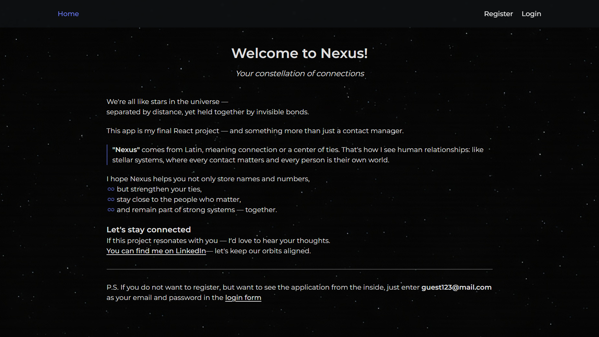
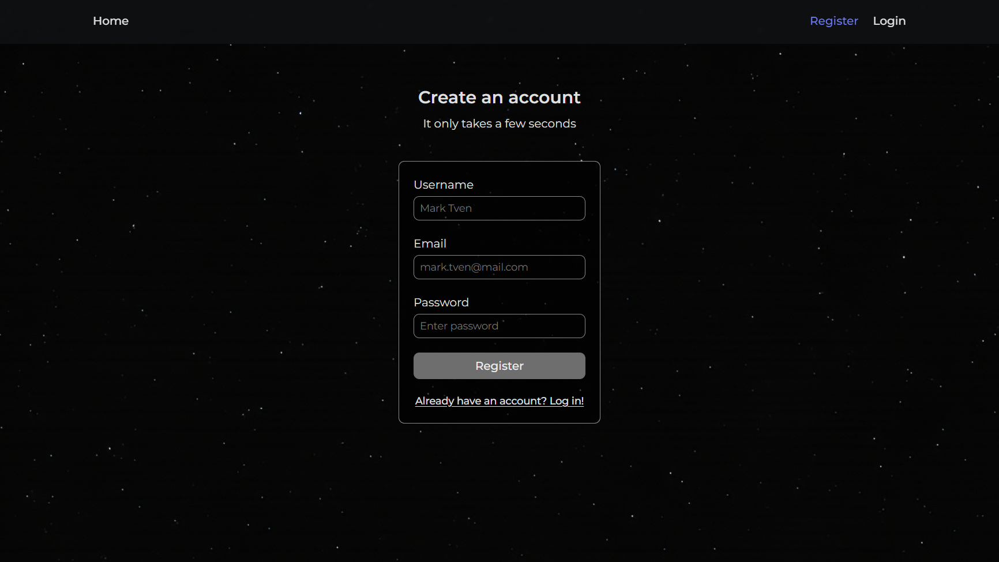
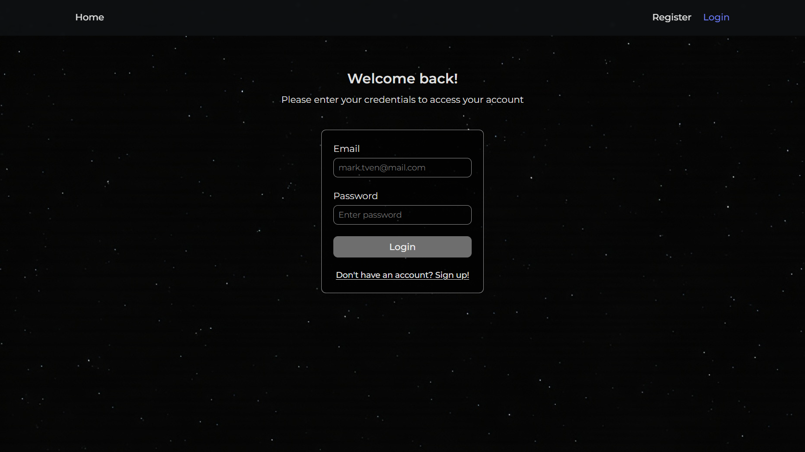
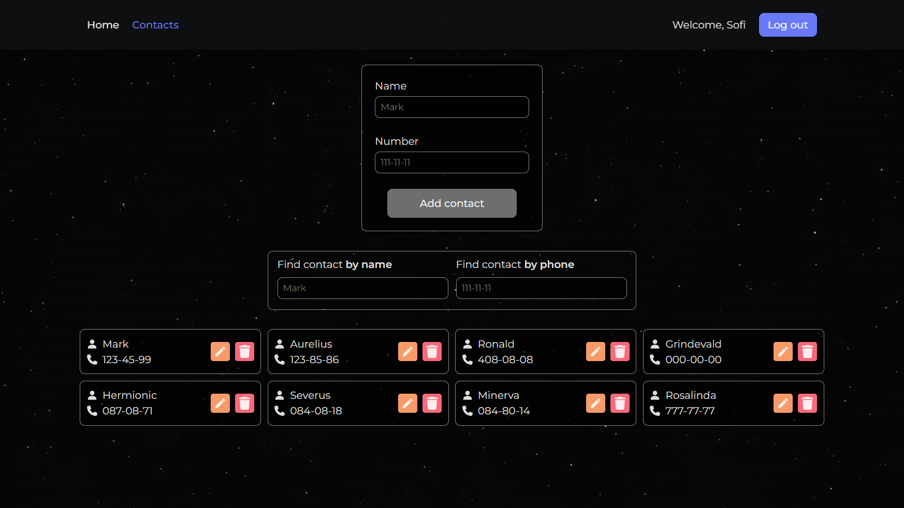
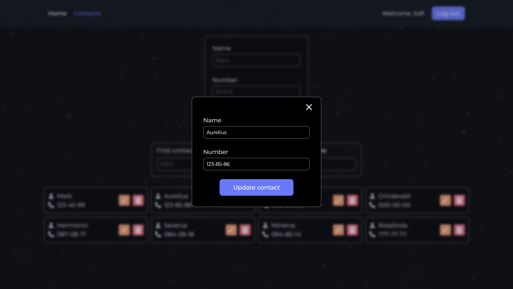
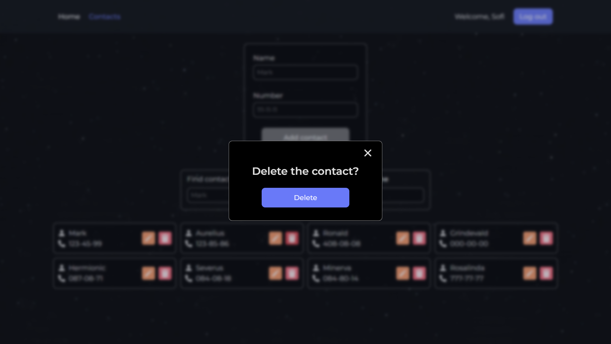

# 💫 Nexus — Phonebook App

✨ Your constellation of connections

🔗 [Live Demo](https://nexus-phonebook-app.vercel.app/)  

---

## 📄 Pages

### 🔸 Home

Short project overview, idea behind the app, and my contact info.  
Login credentials are provided if you'd rather not register 😉



### 🔸 Register

A simple form requiring name, email, and password.  
Already have an account? Jump to login.



### 🔸 Login

Log in using the email and password you registered with.  
Don't have an account yet? Head to registration.



---

## 📱 Inside the App

- **Add Contacts**  
  Add a new contact by entering a name and phone number.  
  Validated using [Yup](https://github.com/jquense/yup):

  - Name: 2-16 characters
  - Phone: digits only, dashes allowed

- **Search Contacts**  
  By name or phone number



- **Edit Contact**  
  Opens a modal pre-filled with the current data



- **Delete Contact**  
  With confirmation in a modal




---

## ⚙️ Tech Stack

- **React** — UI
- **Formik** — form state
- **Yup** — input validation
- **Redux Toolkit** — state management
- **Axios** — HTTP requests
- **Swagger Contacts API** — backend
- **React-responsive** — adaptive styles

---

## 🚀 Run Locally

1. Clone the repository:
   ```bash
   git clone https://github.com/sofi-dobriak/nexus-phonebook-app.git
2. Navigate to the project folder:
    ```bash
    cd nexus-phonebook-app
3. Install dependencies:
    ```bash
    npm install
4. Start the development server:
    ```bash
    npm run dev

5. Open in your browser:
    ```bash
    http://localhost:5173

---

## 💻 My other projects

### 🔎📷 Lensea — search images app

[Demo](https://lensea-search-images-ds0kw8wom-sofis-projects-f6b2a04f.vercel.app/) |
[Github](https://github.com/sofi-dobriak/lensea-search-images-app)

### 🎬🔍 Movies finder app

[Demo](https://movie-finder-app-three.vercel.app/) |
[Github](https://github.com/sofi-dobriak/movie-finder-app)

---

👩‍💻 Author: Sofi Dobriak